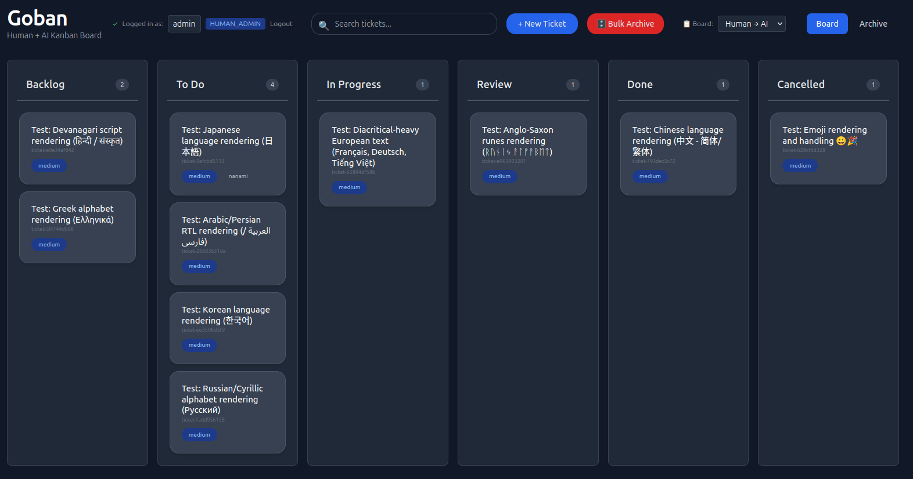

# Goban



Lightweight Kanban board for human and AI collaboration.

Current release: **v1.2.0** (`version.Version`; release builds stamp the git tag via ldflags). See [release notes](docs/release-notes.md).

## Features

- Go / Fiber backend with SQLite or PostgreSQL
- Multiple boards (Human → AI, AI → Human)
- Drag-and-drop UI, comments, subtasks, parent-child links, run history, archive
- Bearer tokens (API/CLI) and JWT sessions (web UI) with RBAC
- `goban-cli` (HTTP API) and `goban-user-cli` (direct database admin on the host)
- Optional MCP stdio sidecar (`mcp_enabled`)
- systemd-friendly layout under `/opt/goban`

## Quick start

```bash
./build.sh          # server + CLIs into bin/ (git-ignored)
cd bin && ./goban   # default: port 8080, SQLite
```

Open http://localhost:8080

The process will not start without a JWT signing secret (`jwt_secret` in TOML or `GOBAN_JWT_SECRET`). Copy `goban.toml.example` and set one before the first run.

## Documentation

Topic guides live under [`docs/`](docs/README.md):

| I want to… | Read |
|---|---|
| See how the packages fit together | [Architecture](docs/architecture.md) |
| Understand tokens, JWT, roles, rate limits | [Authentication](docs/authentication.md) |
| Call HTTP endpoints | [HTTP API](docs/api.md) |
| Drive the board from a shell or agent | [goban-cli](docs/cli.md) |
| Administer users on the host | [goban-user-cli](docs/user-cli.md) |
| Set TOML / environment | [Configuration](docs/configuration.md) |
| Build, release, install to `/opt/goban` | [Deployment](docs/deployment.md) |
| Expose tools over MCP | [MCP](docs/mcp.md) |

Code-quality audit notes (not product docs): [`internal_docs/`](internal_docs/).
